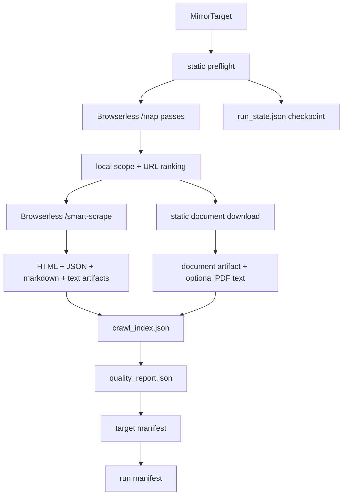

# mirroring

`mirroring` is a standalone Python package for Browserless-first vendor evidence
mirroring. It exists to turn supplier websites into durable local corpora:
rendered HTML for human audit, Browserless JSON for machine processing,
markdown/text for extraction, document artifacts, crawl indexes, and quality
reports.

This README is the developer entrypoint. A new engineer should be able to use
it to:

- understand what the package is and is not
- run the mirror CLI
- inspect the output artifacts
- find the major modules
- understand the Browserless-first architecture
- make common changes without breaking the artifact boundary

## What We Earned

This package exists because `be2/` proved the right mirror shape, but also
showed that acquisition should not be hand-rolled.

The useful pieces from `be2/` are preserved:

- explicit mirror contracts
- per-target corpus directories
- local raw/text artifacts
- crawl indexes
- quality reports
- cache reuse
- deterministic page ranking
- downstream-friendly provenance

The expensive browser work is delegated to Browserless:

- `/map` discovers site URLs
- `/smart-scrape` fetches rendered HTML, markdown, links, strategy metadata,
  and response JSON
- static HTTP is kept only for cheap preflight and document download

The practical result is a smaller package with a clearer job: Browserless does
rendering and discovery; `mirroring` owns policy, scope, artifacts, and
defensibility.

## What This Package Is

- a standalone sibling package to `be2/`
- Browserless-first evidence acquisition
- a vendor-site mirroring tool, not a general crawler platform
- an artifact generator for HTML + JSON + markdown/text corpora
- a deterministic local planner around Browserless `/map` and `/smart-scrape`
- a quality gate for whether a mirrored corpus is complete, partial,
  review-worthy, or failed
- a Python API plus CLI for mirroring one or more targets

## What It Does

- accepts one or more vendor homepage targets
- accepts JSONL target files for larger batches
- accepts per-target `seed_urls` that are force-included regardless of
  `/map` discovery and page_class budgets (used by the
  extract→mirror loop)
- checkpoints progress in `run_state.json`
- resumes paused or incomplete runs with `resume <run-id>`
- reuses prior complete target corpora by default through
  `output/target_registry.json`
- handles `SIGINT` / `SIGTERM` by finishing the current URL and writing state
- runs a cheap static preflight to resolve redirects and obvious content type
- issues targeted Browserless `/map` calls:
  - broad site map
  - products / capabilities
  - compliance / certifications
  - about / contact / headquarters
  - category-specific terms where supplied
- ranks discovered URLs under a profile page budget
- fetches HTML pages through Browserless `/smart-scrape`
- stores both Browserless JSON and rendered HTML for each HTML page
- stores Browserless markdown and normalized text where available
- downloads documents separately through static HTTP
- parses PDF text when possible
- records skipped URLs and reasons in a crawl index
- writes a target-level manifest and quality report
- writes a run-level manifest
- reuses cached Browserless JSON responses by URL when enabled

## What It Does Not Do

- it does not import from `be2/`
- it does not replace the `be2` mirror stage yet
- it does not run local Playwright
- it does not attach to local Chrome over CDP
- it does not implement proxy pools, session pools, or anti-bot logic
- it does not use Browserless `/crawl` in v1 because that API is beta
- it does not perform extraction, qualification, reconciliation, or database
  persistence
- it does not mirror arbitrary sites exhaustively by default

## First Day

From this directory, run the offline test suite:

```bash
PYTHONDONTWRITEBYTECODE=1 PYTHONPATH=src ../be2/.venv/bin/python -m unittest discover -s tests -v
```

That proves:

- contracts serialize and reject unknown fields
- Browserless `/map` responses normalize into URL lists
- Browserless `/smart-scrape` responses preserve JSON, HTML, markdown, links,
  status, headers, strategy, and attempted strategies
- mirror runs write HTML, JSON, markdown, text, document, crawl-index,
  quality-report, and manifest artifacts
- cache reuse avoids duplicate Browserless scrape calls
- low-signal pages are marked for review
- the CLI surfaces parse and dispatch correctly

If you have Browserless credentials, run a live smoke test:

```bash
export BROWSERLESS_API_KEY=...
PYTHONPATH=src python -m uxv_mirroring.cli mirror \
  --target "Example=https://example.com" \
  --profile quick_evidence
```

Inspect the run:

```bash
PYTHONPATH=src python -m uxv_mirroring.cli inspect-run <run-id>
```

Check resumable run state:

```bash
PYTHONPATH=src python -m uxv_mirroring.cli status <run-id>
```

## Mirror Profiles

| Profile | Max pages | Browserless call cap | Intended use | Documents | Expected output |
|---|---:|---:|---|---|---|
| `quick_evidence` | 8 | 10 | fast first-pass vendor evidence | enabled for ranked docs | enough pages to judge basic relevance |
| `serious_vendor` | 50 | 80 | normal supplier corpus | enabled | products/capabilities plus about/contact/compliance when available |
| `full_audit` | 500 | 650 | broad archival run | enabled | large site-level evidence corpus |

All profiles are Browserless-first for HTML pages. Static HTTP is only used for
preflight and document download. The Browserless call cap counts paid
Browserless `/map` plus `/smart-scrape` calls per target. Cache hits do not
spend from the cap.

HTML selection is evidence-first by page class. The planner classifies
discovered URLs as homepage, product, capability, company, contact, compliance,
news, career, or other, then spends the page budget in that order with per-class
caps. Product, capability, company, contact, compliance, privacy, terms, and
legal pages are favored; news/blog pages are capped; career pages are skipped by
default unless the profile policy allows them. URLs rejected by a class cap are
recorded as `skipped_class_budget`.

Document capture is intentionally broader than HTML capture. External document
URLs discovered from an in-scope HTML page may be fetched when their host is in
`associated_document_hosts` defaults such as `storage.googleapis.com` and
`storage.cloud.google.com`. This captures vendor-hosted PDFs and manuals without
treating the whole external host as HTML crawl scope.

## CLI Surface

Mirror one or more targets:

```bash
PYTHONPATH=src python -m uxv_mirroring.cli mirror \
  --target "Vendor A=https://vendor-a.example" \
  --target "Vendor B=https://vendor-b.example" \
  --profile serious_vendor
```

Mirror a JSONL target file:

```bash
PYTHONPATH=src python -m uxv_mirroring.cli mirror \
  --target-file targets.jsonl \
  --profile serious_vendor \
  --run-id supplier-batch-001
```

By default, covered targets are reused from the local target registry when the
homepage, profile, and policy match a prior `complete` corpus. Override that:

```bash
PYTHONPATH=src python -m uxv_mirroring.cli mirror \
  --target-file targets.jsonl \
  --force
```

Use an age limit:

```bash
PYTHONPATH=src python -m uxv_mirroring.cli mirror \
  --target-file targets.jsonl \
  --max-age-days 30
```

Set a per-target Browserless call cap:

```bash
PYTHONPATH=src python -m uxv_mirroring.cli mirror \
  --target "Allocor=https://allocor.tech" \
  --profile quick_evidence \
  --max-calls-per-target 10
```

When the cap is exhausted, unfetched HTML pages are recorded as
`skipped_budget`; the target quality report includes
`browserless_calls_used`, `browserless_call_budget`, and `budget_exhausted`.

Run a compact validation report:

```bash
PYTHONPATH=src python -m uxv_mirroring.cli validate \
  --target "Vendor=https://vendor.example" \
  --profile serious_vendor
```

Inspect an existing run manifest:

```bash
PYTHONPATH=src python -m uxv_mirroring.cli inspect-run <run-id>
```

Resume incomplete work:

```bash
PYTHONPATH=src python -m uxv_mirroring.cli resume <run-id>
```

Retry failed URLs explicitly:

```bash
PYTHONPATH=src python -m uxv_mirroring.cli resume <run-id> --retry-failed
```

Show run status:

```bash
PYTHONPATH=src python -m uxv_mirroring.cli status <run-id>
```

Inspect coverage:

```bash
PYTHONPATH=src python -m uxv_mirroring.cli coverage
PYTHONPATH=src python -m uxv_mirroring.cli coverage \
  --target "Vendor=https://vendor.example" \
  --profile serious_vendor
```

By default, output is written below the current directory:

```text
output/
  runs/
    <run-id>/
  cache/
  target_registry.json
```

Use `--workspace-root` to write somewhere else.

## Output Layout

A run writes:

```text
output/runs/<run-id>/manifest.json
output/runs/<run-id>/run_state.json
output/runs/<run-id>/targets/<target-id>/manifest.json
output/runs/<run-id>/targets/<target-id>/crawl_index.json
output/runs/<run-id>/targets/<target-id>/quality_report.json
output/runs/<run-id>/targets/<target-id>/raw/*.html
output/runs/<run-id>/targets/<target-id>/json/*.json
output/runs/<run-id>/targets/<target-id>/markdown/*.md
output/runs/<run-id>/targets/<target-id>/text/*.txt
output/runs/<run-id>/targets/<target-id>/documents/*
output/cache/<url-hash>/smart_scrape.json
output/target_registry.json
```

Artifact roles:

- `raw/*.html`: rendered HTML from Browserless `content`
- `json/*.json`: full Browserless response plus local mirror metadata
- `markdown/*.md`: Browserless markdown where available
- `text/*.txt`: normalized text derived from markdown first, HTML fallback
- `documents/*`: downloaded document bytes
- `crawl_index.json`: discovered URLs, statuses, skip reasons, resource links
- `quality_report.json`: corpus-level status and reasons
- `run_state.json`: resumable target and URL status
- `target_registry.json`: cross-run complete-corpus registry for target reuse

## Canonical Vendor Evidence (`promote`)

Per-run mirror outputs are the audit ledger. The **canonical** view of
"everything we know about this vendor's website" lives in the sibling
`vendors/<slug>/website/` directory at the project root. The
`promote` subcommand merges all per-run mirror corpora for a given
slug into that canonical layer.

```bash
uxv-mirror promote <slug>                       # merges all runs
uxv-mirror promote <slug> --vendors-root /path  # default: <workspace-root>/../vendors
```

Auto-promote: every successful `mirror` and `resume` invocation
automatically promotes the freshly-mirrored slugs at the end. Manual
`promote` is for re-merging after editing per-run dirs or for
historical vendors mirrored before auto-promote shipped.

Algorithm:

1. Discover all per-run target dirs:
   `output/runs/*/targets/<slug>/manifest.json`, sorted by run
   `created_at`.
2. Build a canonical URL→entry map: latest run wins on content for
   the same URL; `discovered_from` is the union across runs.
3. Resource IDs are **stable** — `vendors/<slug>/website/url_id_map.json`
   tracks every URL's canonical position. Existing IDs are reused;
   new URLs append at the next available numbers (sorted by
   `(depth, url)`). IDs never renumber after first promote.
4. Files copied to a `.tmp` sibling dir, then atomically renamed.
5. Writes canonical `manifest.json`, `crawl_index.json`,
   `quality_report.json`, and appends `promote_log.json` with which
   per-run dirs contributed.

Output:

```text
vendors/<slug>/website/
  manifest.json
  crawl_index.json
  quality_report.json
  promote_log.json     # which per-run dirs contributed and when
  url_id_map.json      # url → resource_id, stable across promotes
  text/      0001-home.txt  0002-...
  markdown/
  raw/
  json/
  documents/
```

Downstream `extract` reads canonical via `--vendor-slug <slug>`. The
`extract` CLI's `canonicalize` subcommand merges per-run extract
outputs alongside the canonical website to produce
`vendors/<slug>/profile.json` + `products.json`.

## Batch Target Files

`--target-file` accepts JSONL: one JSON object per line.

Required fields:

- `display_name`
- `homepage_url`

Optional fields:

- `target_id`
- `categories`
- `notes`
- `seed_urls`: list of URLs to force-include on this run (see "Seed URLs"
  below)
- `follow_ups`: list of `{url, ...}` objects emitted by `uxv-extract
  followups`. The mirror reads only the `url` field from each entry and
  merges them into `seed_urls`.

Blank lines and `#` comment lines are ignored.

Example:

```jsonl
# targets.jsonl
{"display_name":"Vendor A","homepage_url":"https://vendor-a.example","categories":["communications"]}
{"target_id":"vendor-b","display_name":"Vendor B","homepage_url":"https://vendor-b.example"}
{"target_id":"vendor-c","display_name":"Vendor C","homepage_url":"https://vendor-c.example","seed_urls":["https://vendor-c.example/products","https://vendor-c.example/legal/terms"]}
```

## Seed URLs (closing the extract→mirror loop)

The sibling `extract/` package emits a `followups.jsonl` per run that
collects `fetch_requests` from every extracted profile. Each row is a
mirror-target payload with a `follow_ups: [{url, reason,
expected_evidence, source_hint, in_corpus_index}]` field. The mirror
lifts `follow_ups[].url` into `MirrorTarget.seed_urls`.

Seed URLs are:

- **force-included** in `selected_urls` regardless of `/map` discovery —
  if the agent asked for `/products`, the mirror fetches `/products`
- **exempt from page_class budgets** (same exemption the homepage gets) —
  a seed product page does not consume the `product` class budget
- recorded in `crawl_index` with `discovered_from: ["follow_up:seed"]`
  for audit

Seeds remain subject to:

- scope (homepage domain match unless `allow_subdomains`)
- kind filters (`include_documents`, `include_assets`)
- the per-target Browserless call budget

The intended loop:

```
mirror A  →  uxv-extract profile  →  uxv-extract followups
                                          ↓
mirror B (--target-file followups.jsonl --run-id <new-id>)
   →  uxv-extract profile  →  sharper profile.json
```

Each loop iteration should use a **fresh `--run-id`**. Resume into an
existing run will load saved `selected_urls` and skip re-discovery, so
seeds added to an existing run-id will not be picked up.

Repeated `--target` arguments and `--target-file` can be combined. Duplicate
`target_id` values are rejected before run creation.

## Quick Package Map

- `src/uxv_mirroring/contracts.py`: Pydantic contracts for targets, policy,
  resources, crawl index, quality reports, corpora, and run manifests
- `src/uxv_mirroring/browserless.py`: Browserless `/map` and `/smart-scrape`
  adapter
- `src/uxv_mirroring/mirror.py`: mirror orchestration, URL discovery, ranking,
  fetching, cache reuse, quality scoring
- `src/uxv_mirroring/materialize.py`: artifact writes, hashing, HTML/text
  normalization, PDF text parsing
- `src/uxv_mirroring/state.py`: resumable run state, status summaries, stale
  running-state recovery
- `src/uxv_mirroring/cli.py`: command-line entrypoint
- `tests/`: offline fake-client tests

## Runtime Architecture

The important architectural choice is that Browserless is the acquisition
backend, while this package owns all durable artifact semantics.



Layer responsibilities:

- `browserless.py` knows Browserless request/response shapes
- `mirror.py` decides what to fetch and how to score the corpus
- `materialize.py` writes stable local artifacts
- `contracts.py` defines the public artifact boundary
- `cli.py` adapts command-line input into the Python API

## Public Python API

Minimal usage:

```python
from pathlib import Path

from uxv_mirroring import MirrorClient, MirrorTarget
from uxv_mirroring.mirror import policy_for_profile

target = MirrorTarget(
    target_id="example",
    display_name="Example",
    homepage_url="https://example.com",
    categories=["communications"],
)

policy = policy_for_profile("quick_evidence")
corpora = MirrorClient().mirror_targets(
    [target],
    policy=policy,
    workspace_root=Path("."),
)
```

`MirrorClient()` reads Browserless credentials from:

- `BROWSERLESS_API_KEY`
- `BROWSERLESS_TOKEN`

Optional:

- `BROWSERLESS_BASE_URL`, defaulting to
  `https://production-sfo.browserless.io`

## Quality Reports

A target receives one of four statuses:

- `complete`: enough useful HTML/JSON evidence and no material failures
- `partial`: useful evidence exists, but some pages or expected page classes
  failed
- `review_required`: fetched content is sparse, low-signal, or below text
  thresholds
- `failed`: no usable HTML pages were fetched

Common reasons include:

- no usable HTML pages were fetched
- total text below threshold
- no product or capability page fetched
- no about/contact page fetched
- one or more HTML pages failed

Quality reports are intentionally conservative. Their job is to protect the
downstream extraction pipeline from treating a thin or blocked mirror as a
complete evidence corpus.

## Pause And Resume

`mirror` and `resume` install signal handlers for `SIGINT` and `SIGTERM`.

The first signal requests a graceful pause:

- the current URL finishes
- artifacts for that URL are written
- `run_state.json` is updated
- the run status becomes `paused`
- the process exits with `130` for `SIGINT` or `143` for `SIGTERM`

The second signal exits immediately.

Resume continues incomplete work:

```bash
PYTHONPATH=src python -m uxv_mirroring.cli resume <run-id>
```

Default resume behavior:

- completed URLs are skipped
- skipped URLs remain skipped
- failed URLs remain failed
- interrupted `running` targets/URLs are recovered to `pending`
- `--retry-failed` is required to retry failed URLs

## Previous-Run Coverage

Normal `mirror` and `validate` runs are previous-run aware. A target is covered
when all of these match a registry entry:

- normalized homepage URL
- profile
- stable policy hash
- prior quality status is `complete`

Default behavior is reuse:

- the prior `MirrorCorpus` is loaded from its manifest path
- no Browserless calls are made for that target
- the new run manifest records disposition `reused`

Other modes:

- `--skip-covered`: omit covered targets from the run corpora and record
  disposition `skipped_covered`
- `--force`: ignore the registry and bypass the URL smart-scrape cache for a
  true remirror
- `--max-age-days N`: treat older coverage as stale and remirror

If a registry entry points to a missing or invalid corpus manifest, it is
treated as stale.

## Development Notes

Keep these boundaries intact:

- Browserless response JSON is a first-class artifact, not temporary plumbing.
- Rendered HTML must be stored alongside JSON for auditability.
- Text should be derived from markdown first, then HTML fallback.
- `run_state.json` is the source of truth for pause/resume behavior.
- `target_registry.json` is the source of truth for previous-run coverage.
- Static HTTP should not become a second crawler.
- Do not reintroduce local Playwright or Chrome CDP into the default path.
- Do not make extraction decisions in this package; this package mirrors.

When adding a new acquisition backend, keep it behind an adapter like
`BrowserlessClient` and preserve the same `MirrorResource` artifact semantics.
